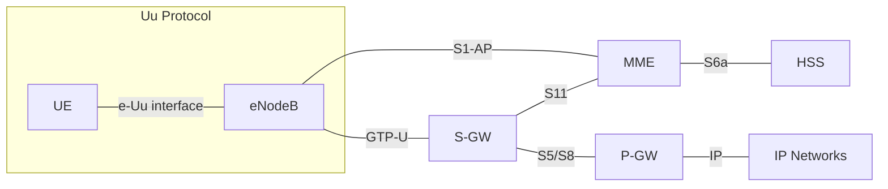
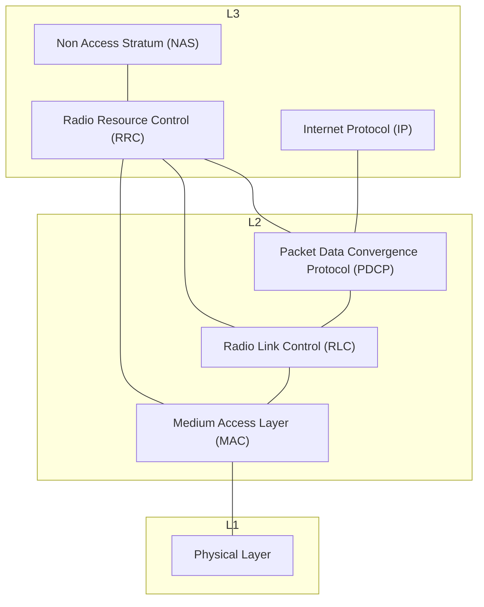
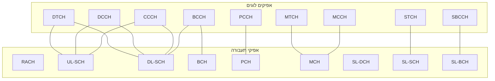

# פרוטוקול הUu

## הקדמה
פרוטוקול הUu הוא הפרוטוקול המקשר בין מכשיר קצה, הטלפון הסלולארי, לבין התא שמשרת אותו.
פרוטוקול זה עובר מעל תווך אווירי.

## שכבות

### השכבה הפיזית

השכבה הפיזית מספקת לשכבה מעליה את אפיקי התעבורה הבאים
- BCH
- DL-SCH 
- PCH
- UL-SCH
- RACH
- MCH
- SL-BCH
- SL-DCH
- SL-SCH

 

### שכבת הMAC
שכבת הMAC אחראית בעיקר למיפוי בין אפיקי תעבורה לאפיקים לוגים.
שכבת הMAC מספקת לשכבות שמעליה גישה לאפיקים הלוגים הבאים:

- BCCH (Broadcast Control Channel)
- PCCH (Paging Control Channel)
- CCCH (Common Control Channel)
- DCCH (Dedicated Control Channel)
- MCCH (Multicast Control Channel)
- DTCH (Dedicated Traffic Channel)
- MTCH (Multicast Traffic Channel)
- STCH (Sidelink Traffic Channel)
- SBCCH (Sidelink Broadcast Control Channel)

כאשר האפיקים הלוגים מורכבים מהאפיקי התעבורה הבאים:

